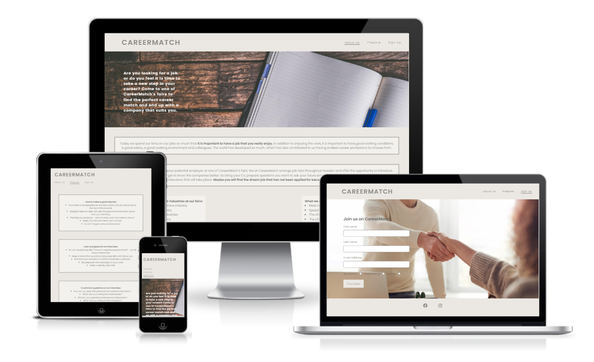

# Career Match

CareerMatch is a company that arranges job fairs around Sweden where employees have the opportunity to meet potential employers. Our fairs help companies and employees to find each other more easily and facilitate the recruitment process. On site, employees can get to know the company better as it is usually a nicer atmosphere than in an interview at the workplace itself. 

CareerMatch's goal is to reduce unemployment in Sweden and contribute to increased health among workers and through this website we want to reach out to anyone who wants to change jobs or is looking for a job.

Welcome to visit our website <a href="https://arneladedovic.github.io/career-match/index.html" target="_blank" rel="noopener"> CareerMatch </a> to read more about our fairs. 

