# Career Match

CareerMatch is a company that arranges job fairs around Sweden where employees have the opportunity to meet potential employers. Our fairs help companies and employees to find each other more easily and facilitate the recruitment process. On site, employees can get to know the company better as it is usually a nicer atmosphere than in an interview at the workplace itself. 

CareerMatch's goal is to reduce unemployment in Sweden and contribute to increased health among workers and through this website we want to reach out to anyone who wants to change jobs or is looking for a job.

Welcome to visit our website <a href="https://arneladedovic.github.io/career-match/index.html" target="_blank" rel="noopener"> CareerMatch </a> to read more about our fairs. 

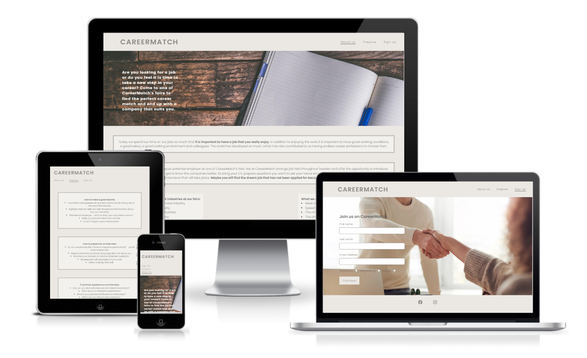

## Features
Career Match's site is set up to be easy to read and find the information you need. 

### Existing Features

- __Navigation Bar__

    * Featured at the top on all three pages so the user easily can navigate from page to page. 

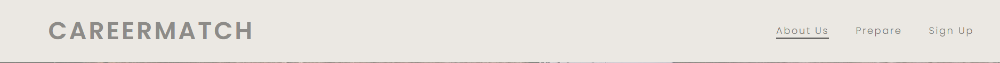

- __Main Image__

    * The main image with a pitch text is there to tell the user which website they are on without having to look for information. 

- __About Us__ 

    * The About Us section will let the user know what opportunities they have by coming to one of our fairs.
    
    * Through this section, they get to see which companies are at the fairs and encourage them to either find a job or upgrade their careers.

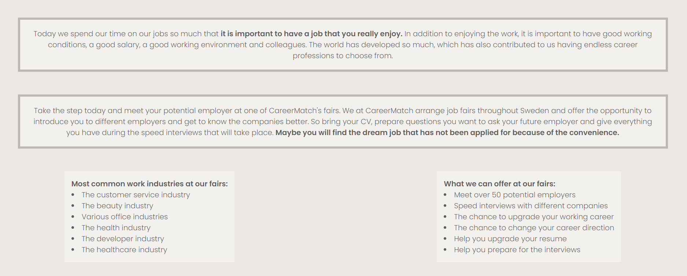

- __Fair Times & Places__

    * The Times & Places section will let the user know when the fairs will happen and where they will be located.

    * The Times & Places section will be updated continuously each year. 

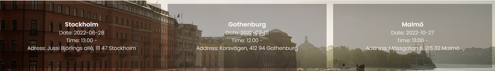

- __The Footer__

    * The Footer section include links to CareerMatch's social media sites and encourages them to connect with CareerMatch.
    * The Footer section is featured on all three pages so the user doesn't have to go back to the home page to connect with us on social media. 

- __The Prepare Page__

    * The Prepare page will provide the user information about how to prepare for our fairs, their resumes and interviews.
    * The Prepare page is valuable to the user as it will prepare them for future fairs and interviews and increase the chance of getting a job.

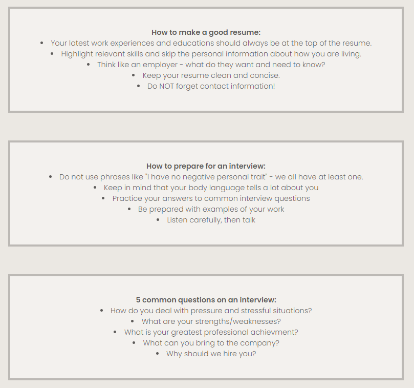

- __The Sign Up Page__

    * The Sign Up Page allows the user to sign up to our fairs.
    * They can choose which fairs they want to attend and fill in their information, such as name and email.

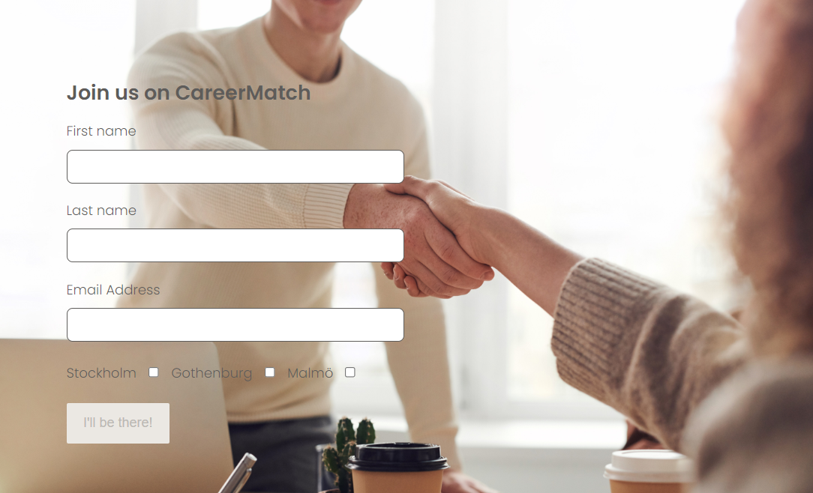

### Features Left To Implement

* A consultation page where you can book in to meet a consultant who will help employees sharpen their resume and improve their interview skills. 

* A video page where it will be updated with useful and learning videos on various interview tips, body language at interviews and do and dont's.

* A page with information about job vacancies.

## Technologies Used

* GitHub - used to deploy the website.
* GitPod - used to edit the website.
* HTML5 - provides structure and content for the website.
* CSS - provides the styling.

## Site Structure

* CareerMatch has three pages. The "About Us" is the default page and the Prepare and Sign Up are accessible through the Navigation Menu.

## Design

* ### Color Scheme
    
   * The colour scheme chosen was based on a modern and calming feeling. 

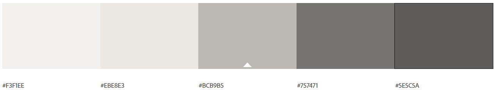

* ### Typography 

    * The fonts chosen was 'Poppins Semibold 600' for headings and 'Poppins Light 300' for the body text. 

    * The 'Poppins Semibold 600' gave the headings a bold and visible text and the 'Poppins Light 300' gave the bodytext a light but easy to read text. 

## Testing

* The CareerMatch has been tested. The codes has been run through the WC3 HTML Validator and WC3 CSS Validator. 
The tests images below are from HTML-Validator and CSS-Validator
  
    * Home Page:
    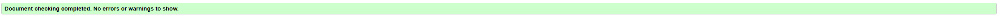
    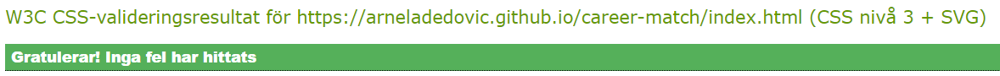

    * Prepare Page:
    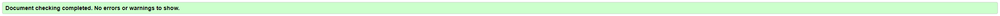
    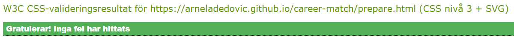

    * Sign Up Page:
    
    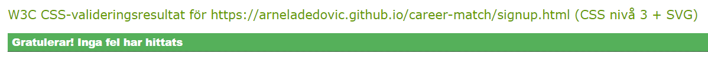

### Known Bugs

* One bug became known during the validation stage, see image below. 
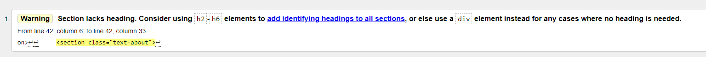
It was easily fixed by changing out the < section> to a < div>. 

* #### Unresolved bugs: none.

## Additional Testing

### Lighthouse

CareerMatch was also tested through Google Lighthouse for each page. See images for each page below. 

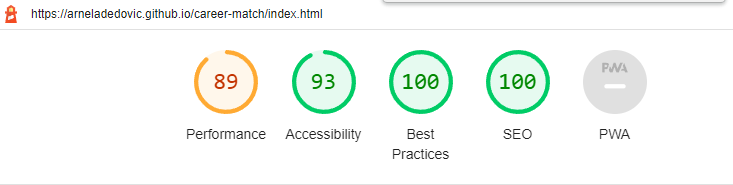
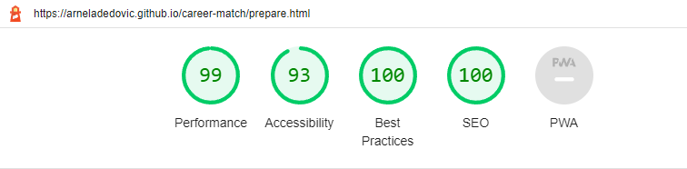
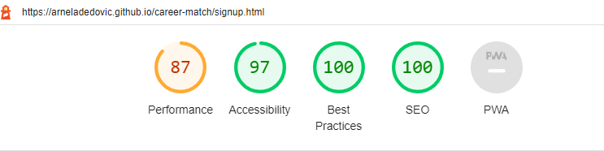

## Deployment

### To deploy the project:
* The site was deployed to GitHub Pages. The steps to deploy are as follows:
    * In the GitHub repository, go to the Settings tab
    * Navigate to the Pages on the left side
    * Under Source, select the branch to 'main', then click save
    * Once the 'main' branch has been selected, the page will automatically be refreshed with a detailed ribbon display to indicate the successful deployment!

The live link can be found here: https://arneladedovic.github.io/career-match/

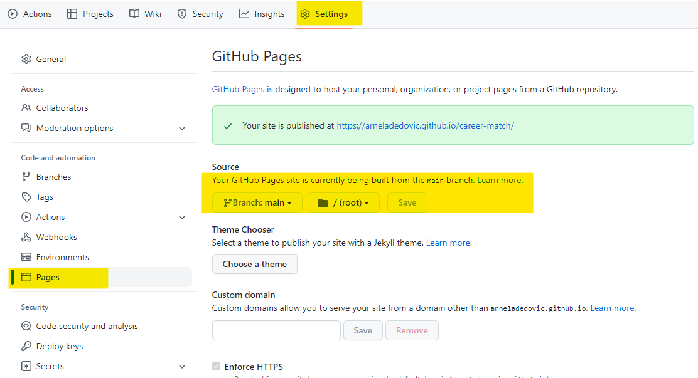

### To fork the repository on GitHub:

* A copy of the repository on GitHub can be made by forking the GitHub account. The steps to fork the repository are as follows: 
    * Log in to GitHub and locate the repository: 
    * On the right side of the page is a button called 'Fork'. 
    * Click on the button to create a copy of the original repository

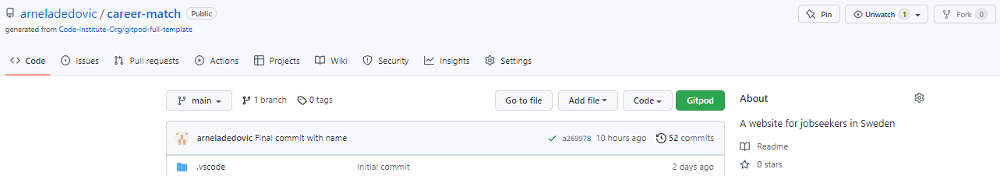

### To create a clone of the project:

* The steps to clone the project are as follows:
    * Under the repository, click on the code tab
    * In the 'Clone with HTTPS'-section, click on the clipboard icon to cope the given URL
    * In your IDE of choice - open Git Bash
    * Change the directory to the location where you want the cloned directory to be made
    * Type 'Git Clone' and paste the URL copy
    * Press 'enter' and the clone will be created

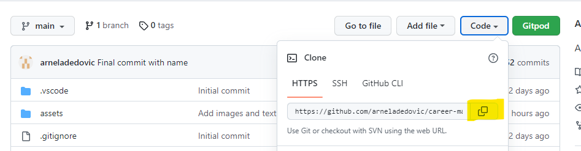

## Credits

* ### Content
    * The font came from: [Google Fonts](https://fonts.google.com/)
    * The color palette was created on: [Adobe Color](https://color.adobe.com/sv/create/color-wheel) 
    * The icons came from: [Font Awesome](https://fontawesome.com/)

* ### Media
    * The photos used on the pages came from: [Pexels](https://www.pexels.com/sv-se/) and [Pixabay](https://pixabay.com/)

## Acknowledgements
CareerMatch was completed as a Porfolio 1 Project for the Full Stack Software Developer education at the [Code Institute](https://codeinstitute.net/). I would like to thank the Slack Community, Code Institute and my mentor for the help and support during this project. 

### **Arnela Dedovic, 2022.**
